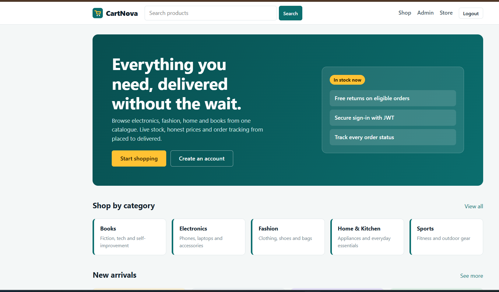
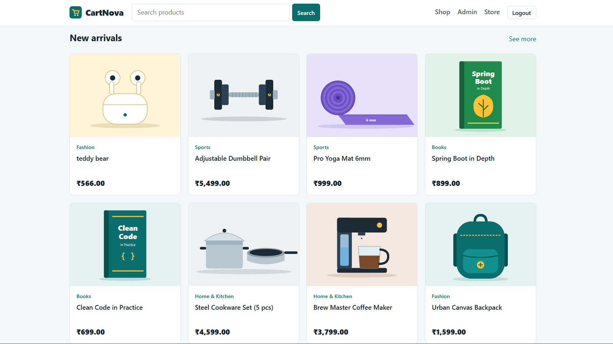
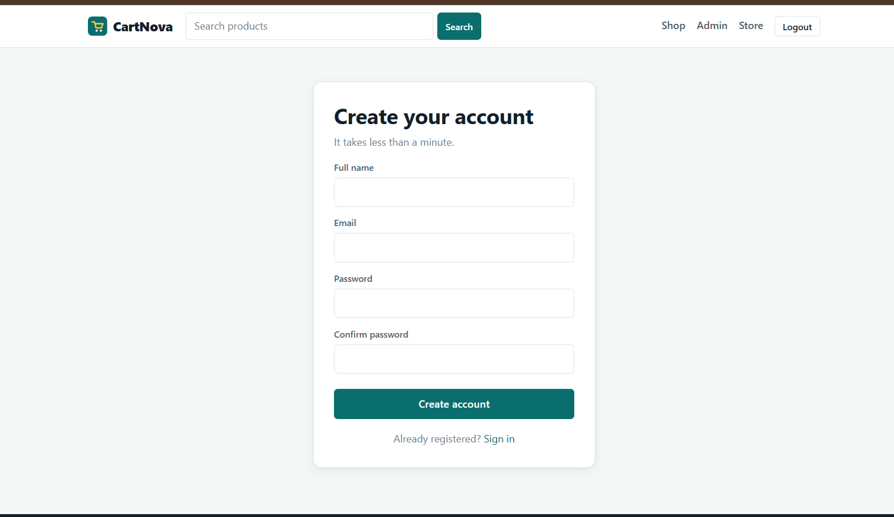
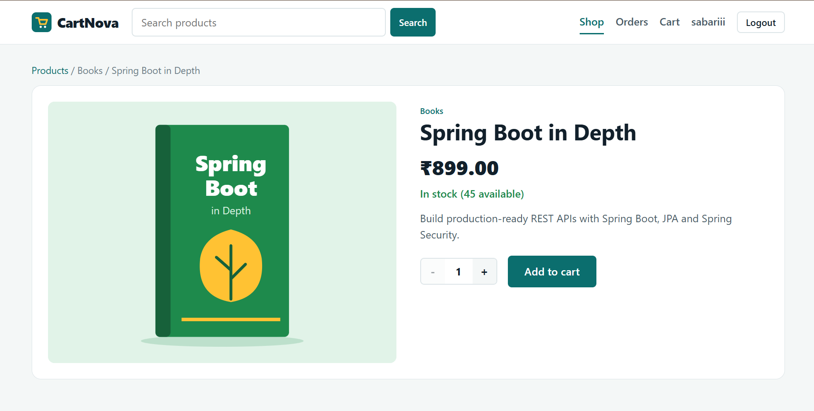
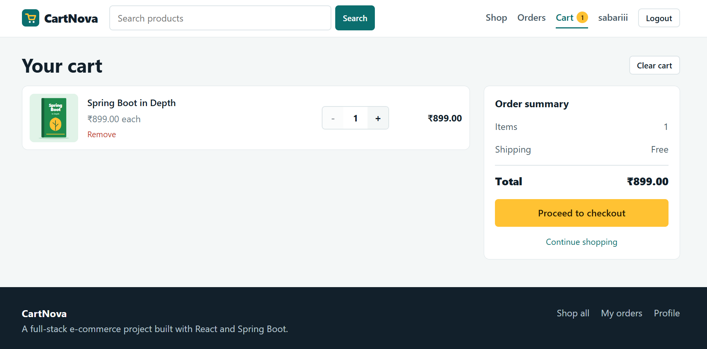
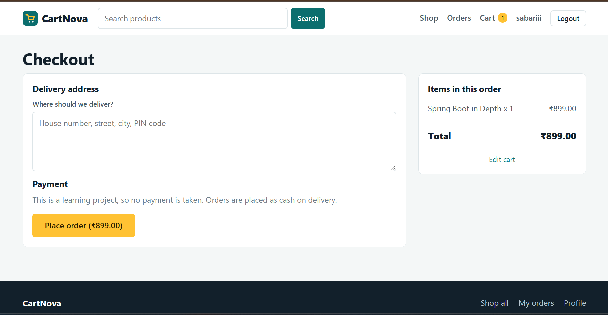

# CartNova 🛒

A full-stack e-commerce application built with **React** and **Spring Boot**. CartNova provides a complete shopping flow including authentication, product browsing, search, cart management, checkout, and order tracking, with a separate admin experience for managing the store.

## ✨ Features

### Customer Features
- User registration and login
- JWT-based authentication
- Browse products by category
- Search products
- View product details
- Check product stock availability
- Add products to cart
- Increase/decrease item quantity
- Remove products from cart
- Clear cart
- Checkout and place orders
- View order history
- Track order status
- User profile

### Admin Features
- Admin authentication
- Product management
- Product creation, update and deletion
- Inventory/stock management
- Order management
- Order status updates
- Separate admin navigation and dashboard

### Backend Features
- RESTful APIs using Spring Boot
- Layered architecture: Controller → Service → Repository
- Spring Data JPA and Hibernate
- MySQL database integration
- DTO-based API communication
- Spring Security
- JWT authentication and role-based authorization
- Password hashing with BCrypt
- Bean validation
- Global exception handling
- Transactional checkout/order processing
- CORS configuration

### Frontend Features
- React-based single-page application
- Vite development setup
- React Router navigation
- Responsive e-commerce UI
- Centralized API communication
- Authentication state handling
- Customer and admin route protection

---

## 🛠️ Tech Stack

### Frontend
- React.js
- JavaScript
- Vite
- React Router
- Axios
- CSS

### Backend
- Java 23
- Spring Boot 3.3.5
- Spring Web
- Spring Data JPA
- Hibernate
- Spring Security
- JWT
- Maven

### Database
- MySQL

### Tools
- IntelliJ IDEA
- Visual Studio Code
- MySQL / MySQL Workbench
- Postman
- Git & GitHub

---

## 🏗️ Project Architecture

CartNova is organized as a separate frontend and backend application:

```text
CartNova
│
├── cartnova-backend
│   ├── src
│   │   └── main
│   │       └── java
│   │           └── com.sabari.cartnova
│   ├── pom.xml
│   └── Dockerfile
│
├── cartnova-frontend
│   ├── src
│   ├── public
│   ├── package.json
│   ├── package-lock.json
│   ├── vite.config.js
│   └── Dockerfile
│
└── README.md
```

### Request Flow

```text
React Frontend
      │
      │ REST API / JSON
      ▼
Spring Boot Controller
      │
      ▼
Service Layer
      │
      ▼
Spring Data JPA
      │
      ▼
Hibernate
      │
      ▼
MySQL Database
```

---

## 🔐 Authentication & Authorization

CartNova uses JWT-based authentication.

```text
User
 │
 │ Login
 ▼
Spring Security
 │
 │ Validate credentials
 ▼
JWT Token
 │
 │ Authorization: Bearer <token>
 ▼
Protected API
```

The application supports role-based access:

```text
USER
 ├── Browse products
 ├── Manage cart
 ├── Checkout
 └── View orders

ADMIN
 ├── Manage products
 ├── Manage inventory
 └── Manage orders
```

Passwords are stored using BCrypt hashing rather than plain text.

---

## 🛒 Shopping Flow

```text
Register / Login
       ↓
Browse Products
       ↓
Search / Filter
       ↓
View Product
       ↓
Add to Cart
       ↓
Update Cart
       ↓
Checkout
       ↓
Create Order
       ↓
View Order History
       ↓
Track Order Status
```

---

## 🗄️ Main Data Model

The application uses relational entities for users, products, carts and orders.

A simplified relationship looks like:

```text
User
 │
 ├── Cart
 │    └── CartItem ─── Product
 │
 └── Order
      └── OrderItem ─── Product

Product
 └── Category
```

This allows the application to maintain products, cart items and order information using MySQL with JPA/Hibernate.

---

## 📸 Sample Application Output

### 1. CartNova Home Page

The home page provides product search, shopping navigation, category browsing and featured/new products.



### 2. Product Listing / New Arrivals

Products are displayed with their category, name, image and price.



### 3. User Registration

Users can create an account with their name, email and password.



### 4. Product Details

The product details page displays the product image, category, price, stock availability and description, with an option to add the product to the cart.



### 5. Shopping Cart

The cart shows selected products, quantities, individual prices and the complete order summary.



### 6. Checkout Details

The checkout details page displays the product image, category, price, stock availability and description, with an option to add the product to the cart.



---

## 🚀 Getting Started

### Prerequisites

Make sure the following are installed:

- Java 23
- Maven
- Node.js and npm
- MySQL
- Git

---

## 1. Clone the Repository

```bash
git clone <YOUR_GITHUB_REPOSITORY_URL>
cd CartNova
```

---

## 2. Backend Setup

Open the backend folder:

```bash
cd cartnova-backend
```

Configure the MySQL database and the application's database credentials in the backend configuration.

Example database:

```sql
CREATE DATABASE cartnova;
```

Then start the Spring Boot application:

```bash
mvn spring-boot:run
```

Or run:

```text
CartNovaApplication.java
```

from IntelliJ IDEA.

The backend runs on:

```text
http://localhost:8080
```

---

## 3. Frontend Setup

Open a second terminal:

```bash
cd cartnova-frontend
```

Install dependencies:

```bash
npm install
```

Create the environment file from the provided example:

```bash
copy .env.example .env
```

Update the API URL in `.env` according to the backend configuration.

Then start the frontend:

```bash
npm run dev
```

The Vite development server normally runs on:

```text
http://localhost:5173
```

---

## 🔌 Frontend ↔ Backend Communication

The React frontend communicates with the Spring Boot backend through REST APIs.

```text
Browser
   │
   │ HTTP / JSON
   ▼
React + Vite
   │
   │ Axios
   ▼
Spring Boot REST API
   │
   ▼
MySQL
```

Example flow:

```text
Login Form
    ↓
POST /api/auth/login
    ↓
Spring Security
    ↓
JWT Token
    ↓
React stores authentication state
    ↓
Authenticated API requests
```

---

## 🧪 Testing

API endpoints can be tested using **Postman**.

Recommended testing areas:

- User registration
- User login
- JWT authentication
- Product listing
- Product search
- Product details
- Cart operations
- Checkout
- Order history
- Admin product management
- Admin order management
- Unauthorized/forbidden requests

---

## 🐳 Docker

Both the backend and frontend include Docker configuration.

The project can be containerized so that the application components can run consistently across environments.

```text
React Frontend
      │
      ▼
Frontend Container

Spring Boot Backend
      │
      ▼
Backend Container

MySQL
      │
      ▼
Database
```

Use the Docker configuration included in the respective project folders when running the application with Docker.

---

## 📁 Repository Structure

```text
CartNova/
│
├── cartnova-backend/
│   ├── src/
│   ├── .gitignore
│   ├── Dockerfile
│   └── pom.xml
│
├── cartnova-frontend/
│   ├── public/
│   ├── src/
│   ├── .env.example
│   ├── .gitignore
│   ├── Dockerfile
│   ├── index.html
│   ├── nginx.conf
│   ├── package.json
│   ├── package-lock.json
│   └── vite.config.js
│
├── docs/
│   └── screenshots/
│       ├── home-hero.png
│       ├── home-products.png
│       ├── register.png
│       ├── product-details.png
│       └── cart.png
│
└── README.md
```

---

## 🎯 Project Goals

CartNova was developed to demonstrate practical full-stack development using Java and modern web technologies.

The project focuses on:

- Building REST APIs with Spring Boot
- Implementing authentication and authorization
- Working with relational databases using JPA/Hibernate
- Connecting React with a Java backend
- Designing real-world e-commerce workflows
- Managing cart and order data
- Applying layered backend architecture
- Working with Git and GitHub
- Preparing an application for Docker-based deployment

---

## 📌 Key Learning Outcomes

Through this project, the following concepts are demonstrated:

- Core Java and object-oriented programming
- Spring Boot application development
- REST API development
- Spring Security and JWT
- JPA/Hibernate
- MySQL database design
- React frontend development
- API integration with Axios
- Authentication and protected routes
- Role-based access control
- Exception handling and validation
- Git/GitHub project management
- Docker fundamentals

---

## 👨‍💻 Author

**Sabarinathan M**

B.Tech Computer Science and Engineering

- GitHub: https://github.com/Sabarii27
- LinkedIn: https://www.linkedin.com/in/sabari27/

---

## ⭐ Project Summary

**CartNova** is a full-stack e-commerce application that combines a **React frontend** with a **Spring Boot REST backend** and **MySQL database**. It demonstrates authentication, role-based authorization, product management, cart operations, checkout, order tracking and admin functionality in a realistic e-commerce workflow.
